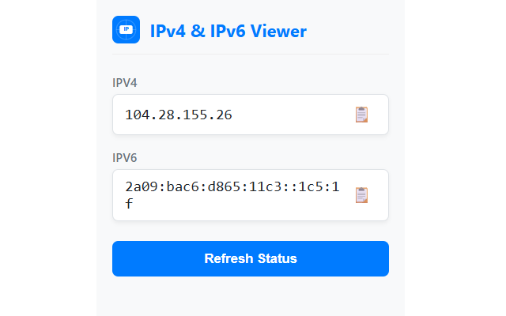

# MyIP IPv4 & IPv6 Viewer 🌐🔍

**MyIP IPv4 & IPv6 Viewer** is an ultra-lightweight, fast, and privacy-focused browser extension that instantly displays your public network addresses. No more loading heavy external websites or dealing with intrusive ads just to find your network details—get the full picture in a single click.

Perfect for developers, network administrators, and privacy-conscious users validating VPN/Proxy configurations.

---

## 🚀 Key Features

* **🌐 Dual-Protocol Display:** Displays both your public IPv4 and IPv6 addresses simultaneously, side-by-side.
* **📋 One-Click Copy:** Click the clipboard icon next to either address to copy it instantly—no manual highlighting required.
* **⚡ Zero Background Overhead:** Runs *only* when you click the popup. It consumes absolutely zero browser memory or CPU cycles in the background.
* **🔄 Manual Refresh:** Instantly refresh your connection tokens with a single click—ideal for rapid VPN and proxy change testing.
* **🔒 Privacy-First Design:** Zero tracking, zero analytics scripts, and zero data logging. The extension directly queries secure public APIs client-side only when explicitly opened.

---

## 📸 Screenshots

  

---

## 📥 Installation

Install the official extension directly from your preferred browser web store:

* **Chrome Web Store:** [Get it for Google Chrome](https://chromewebstore.google.com/detail/myip-ipv4-ipv6-viewer/bnjgghaofcbgkagkimfedeoldcfegpce)
* **Microsoft Edge Add-ons:** [Get it for Microsoft Edge](https://microsoftedge.microsoft.com/addons/detail/myip-ipv4-ipv6-viewer/oedifjkomaciheimeikdianbioelbgeh)
* **Firefox Add-ons:** [Get it for Mozilla Firefox](https://addons.mozilla.org/en-CA/firefox/addon/myip-ipv4-ipv6-viewer/)

---

## 🧭 How It Works

1. Click the **MyIP** icon in your browser's extension toolbar.
2. View your live IPv4 and IPv6 public addresses inside the popup.
3. Click the 📋 icon next to the address to copy it to your clipboard with clean visual feedback.
